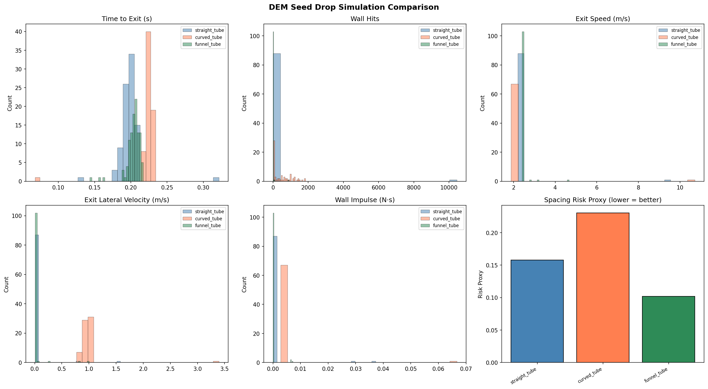
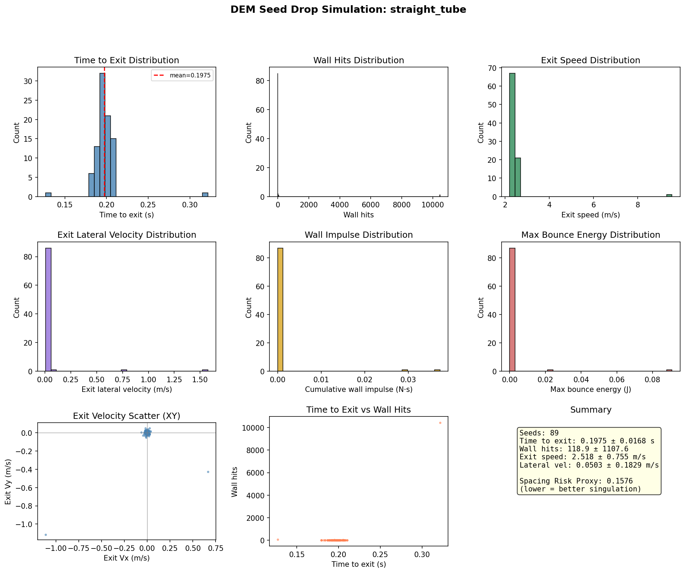
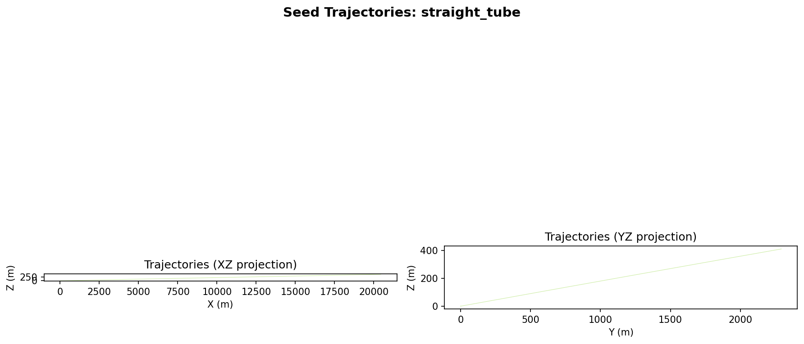
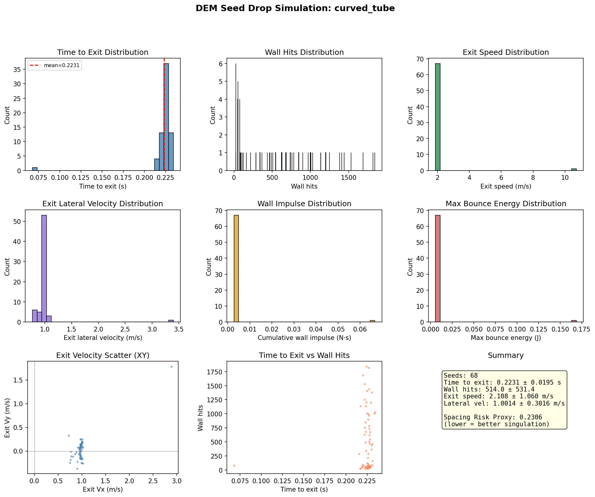
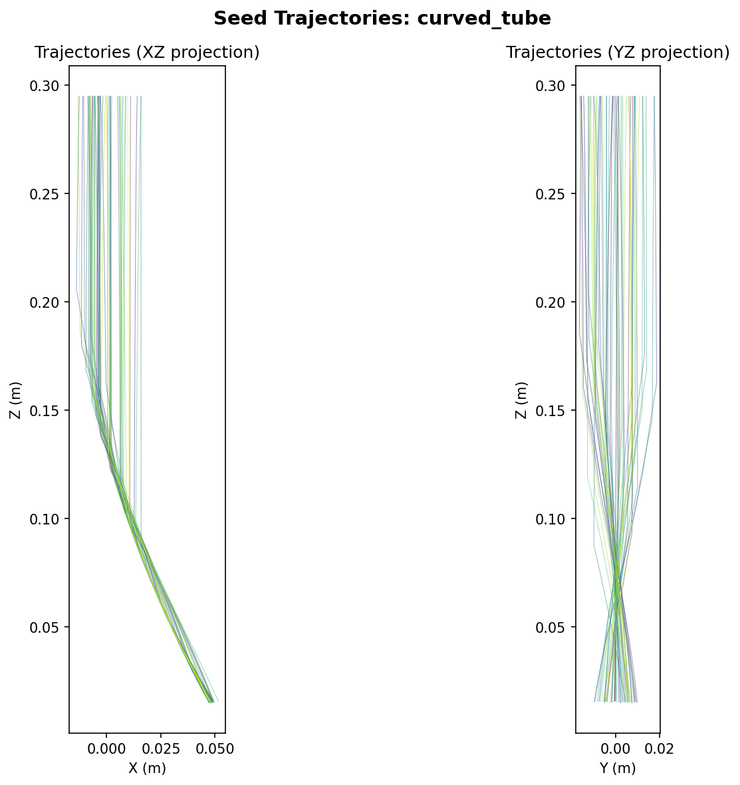
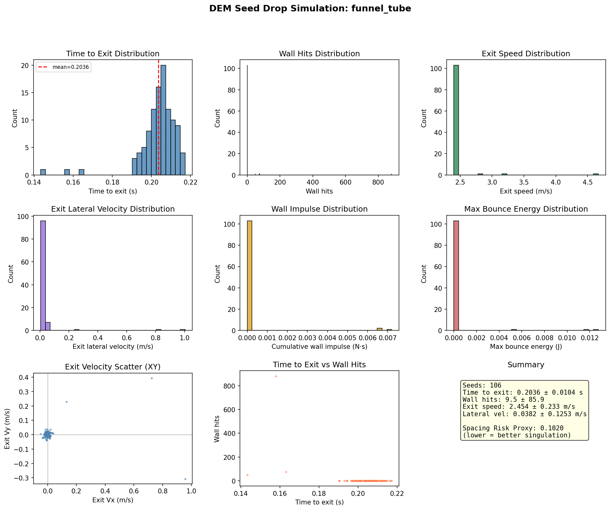
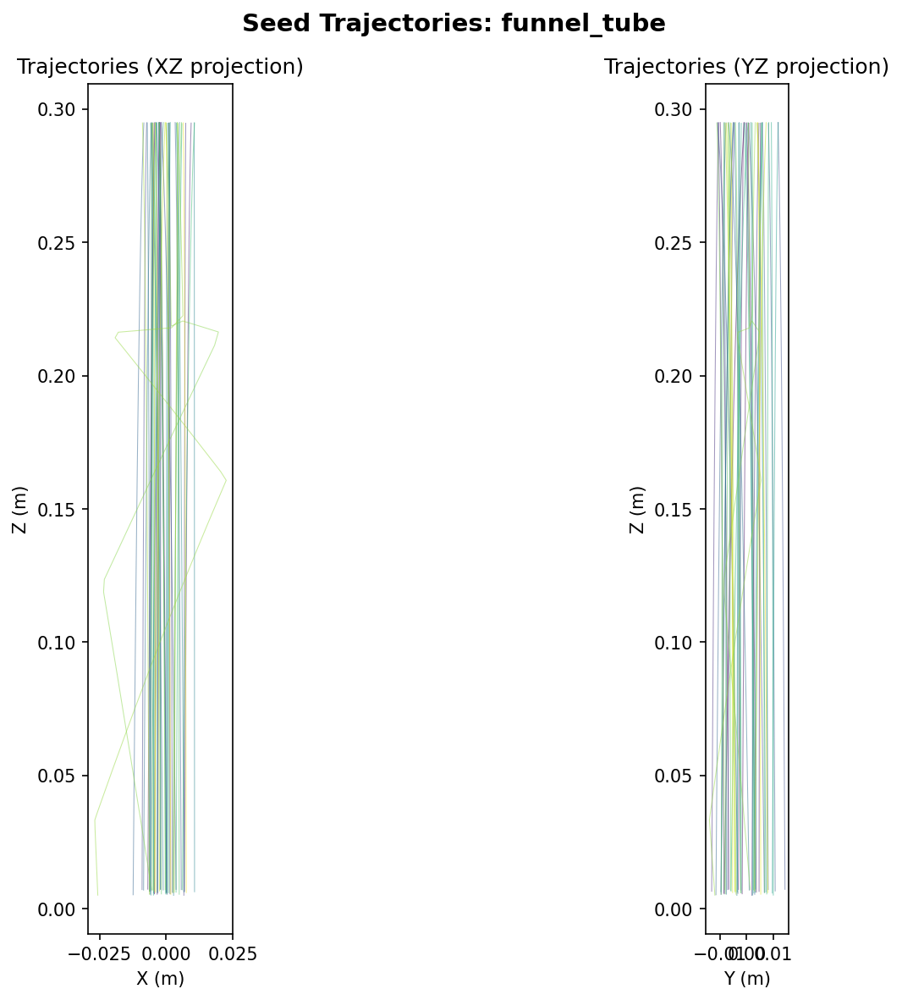

# DEM Seed Drop-Tube Simulator

A production-grade Discrete Element Method (DEM) simulator for planter seed drop-tube design. Predicts and compares drop-tube geometries by measuring wall hits, bounce energy, residence time, exit velocity, and spacing variability.

Optional one-way coupling to LBM airflow fields exported from FluidX3D.



## Simulation Results

Three tube geometries were simulated with identical injection conditions (seed rate 40-60/s, 2.0s max time, corn/mung seed models):

| Metric | Straight Tube | Curved Tube (30deg) | Funnel Tube |
|--------|:---:|:---:|:---:|
| **Seeds exited** | 89 | 68 | 106 |
| **Exit speed** (m/s) | 2.52 +/- 0.75 | 2.11 +/- 1.06 | 2.45 +/- 0.23 |
| **Lateral velocity** (m/s) | 0.05 +/- 0.18 | 1.00 +/- 0.30 | 0.04 +/- 0.13 |
| **Wall hits** (mean) | 119 | 514 | 9.5 |
| **Avg wall impulse** (N*s) | 0.0007 | 0.0046 | 0.0002 |
| **Spacing risk proxy** | 0.158 | 0.231 | **0.102** |

The **funnel tube** (cone geometry, 35mm top to 18mm bottom) achieves the best singulation with the lowest spacing risk proxy (0.102), tightest exit speed distribution (SD=0.23 m/s), and minimal lateral scatter. The **curved tube** (30-degree bent cylinder) produces the most wall interactions and highest lateral exit velocity, as expected from the bend deflecting seed trajectories. The **straight tube** (30mm cylinder) provides a balanced baseline.

### Straight Tube

30mm diameter, 300mm length. Seeds fall under gravity with minimal wall contact.




### Curved Tube (30-degree Bend)

30mm diameter, single bent cylinder with 0.573m bend radius and 30-degree deflection. Seeds interact with the outer wall of the bend, gaining lateral velocity.




### Funnel Tube (Converging Cone)

35mm diameter at top narrowing to 18mm at bottom. The converging geometry focuses seeds toward the center, reducing lateral scatter and improving spacing uniformity.




## Build

### Requirements
- C++17 compiler (g++ 8+ or clang 7+)
- CMake 3.14+
- OpenMP (optional, for parallelism)
- Python 3.6+ with matplotlib and numpy (optional, for postprocessing plots)

### Compile

```bash
cd dem
mkdir build && cd build
cmake .. -DCMAKE_BUILD_TYPE=Release
make -j$(nproc)
```

Produces:
- `dem_sim` - CLI simulator executable
- `dem_tests` - Validation test suite (53 checks across 14 tests)

### Run Tests

```bash
./dem_tests
```

All 53 tests validate: math operations, contact model energy dissipation, cylinder/cone collision detection, spatial hash grid, injector, exit plane, particle system management, determinism, and bounce physics.

## Quick Start

```bash
# Run the three tube designs
./dem_sim ../examples/straight_tube.json
./dem_sim ../examples/curved_tube.json
./dem_sim ../examples/spiral_tube.json   # funnel/cone tube

# Generate comparison plots
python3 ../python/dem_postprocess.py output/straight_tube \
    --compare output/curved_tube output/funnel_tube

# View individual results
python3 ../python/dem_postprocess.py output/curved_tube
```

## CLI Usage

```
dem_sim <config.json> [options]

Options:
  --output-dir <dir>  Override output directory
  --dt <seconds>      Override timestep
  --max-time <sec>    Override max simulation time
  --seed <int>        Override RNG seed (for deterministic runs)
  --quiet             Suppress progress output
  --help              Show help
```

## Config Schema

JSON configuration with these top-level sections:

### `simulation`
| Field | Type | Default | Description |
|-------|------|---------|-------------|
| `dt` | float | 1e-5 | Timestep (s). Auto-computed if `auto_dt` is true |
| `max_time` | float | 2.0 | Maximum simulation time (s) |
| `gravity` | [x,y,z] | [0,0,-9.81] | Gravity vector (m/s^2) |
| `auto_dt` | bool | true | Auto-compute safe timestep from stiffness |
| `dt_safety` | float | 0.1 | Fraction of critical timestep to use |
| `rng_seed` | int | 12345 | Random seed (deterministic) |
| `output_dir` | string | "output" | Output directory path |
| `save_trajectories` | bool | true | Save trajectory data |
| `tube_axis` | [x,y,z] | [0,0,-1] | Tube axis for lateral velocity computation |

### `seed_types`
Array of seed type definitions:

| Field | Type | Default | Description |
|-------|------|---------|-------------|
| `name` | string | "default" | Seed name |
| `shape` | string | "sphere" | "sphere" or "ellipsoid" (multi-sphere) |
| `radius` | float | 0.004 | Sphere radius (m) |
| `mass` | float | 0.001 | Mass (kg) |
| `a`, `b`, `c` | float | - | Ellipsoid semi-axes (m) |

### `contact`
Contact properties for `seed_seed` and `seed_wall` pairs:

| Field | Type | Default | Description |
|-------|------|---------|-------------|
| `kn` | float | 1e4 | Normal stiffness (N/m) |
| `kt` | float | 2500 | Tangential stiffness (N/m) |
| `restitution` | float | 0.5 | Coefficient of restitution |
| `friction` | float | 0.5 | Sliding friction coefficient |
| `rolling_friction` | float | 0.01 | Rolling friction coefficient |

### `geometry`
Tube geometry definition. Supports mesh files and/or analytic primitives.

```json
"geometry": {
    "mesh": "tube.stl",
    "primitives": [
        {"type": "cylinder", "center": [0,0,0], "axis": [0,0,1], "length": 0.3, "radius": 0.025},
        {"type": "cone", "center": [0,0,0], "axis": [0,0,1], "length": 0.3, "radius_top": 0.035, "radius_bottom": 0.018},
        {"type": "bent_cylinder", "center": [0,0,0.30], "radius": 0.03, "bend_radius": 0.573, "bend_angle": 0.5236},
        {"type": "plane", "center": [0,0,0], "plane_normal": [0,0,1]}
    ]
}
```

Primitive types:
- **cylinder**: Straight tube section. `center` is the base, `axis` points toward the top, `length` along the axis.
- **cone/frustum**: Tapered section. `radius_top` at the axis-end, `radius_bottom` at the base.
- **bent_cylinder**: Curved tube section in the XZ plane. `center` is the entry point, `bend_radius` is the radius of curvature, `bend_angle` (radians) is the total deflection angle. The tube enters pointing downward (-Z) and bends toward +X.
- **plane**: Flat surface for testing.

### `injector`
Seed injection parameters:

| Field | Type | Default | Description |
|-------|------|---------|-------------|
| `position` | [x,y,z] | [0,0,0.3] | Inlet center |
| `direction` | [x,y,z] | [0,0,-1] | Injection direction |
| `seeds_per_second` | float | 100 | Injection rate |
| `max_seeds` | int | 5000 | Total seeds to inject |
| `aperture_shape` | string | "circular" | "circular" or "rectangular" |
| `aperture_radius` | float | 0.02 | Circular aperture radius (m) |
| `initial_speed` | float | 0.0 | Mean injection speed (m/s) |
| `speed_stddev` | float | 0.0 | Speed standard deviation |
| `lateral_speed_stddev` | float | 0.01 | Lateral velocity scatter |

### `exit_plane`
| Field | Type | Description |
|-------|------|-------------|
| `point` | [x,y,z] | Point on exit plane |
| `normal` | [x,y,z] | Outward normal (particles exit in -normal direction) |

### `airflow`
LBM velocity field coupling:

| Field | Type | Default | Description |
|-------|------|---------|-------------|
| `enabled` | bool | false | Enable airflow coupling |
| `path` | string | - | Path to velocity field file |
| `format` | string | "binary" | "binary" or "npy" |
| `drag_Cd` | float | 0.9 | Constant drag coefficient |
| `schiller_naumann` | bool | false | Use Reynolds-dependent Cd |
| `air_density` | float | 1.225 | Air density (kg/m^3) |

## Output Files

| File | Description |
|------|-------------|
| `seeds.csv` | Per-seed metrics: time_to_exit, wall_hits, impulse, exit velocity |
| `summary.csv` | Aggregate statistics: means, std devs, spacing risk proxy |
| `trajectories.vtk` | VTK polydata for 3D visualization (ParaView) |
| `trajectories.csv` | CSV trajectory data (particle_id, time, x, y, z) |

## Metrics

### Per-seed
- **time_to_exit**: Residence time from injection to exit
- **wall_hits**: Number of wall contacts with significant impulse
- **cumulative_impulse**: Total normal impulse on wall (N*s)
- **max_bounce_energy**: Maximum kinetic energy at a wall contact (J)
- **exit_velocity**: Full 3D exit velocity vector
- **exit_lateral_velocity**: Component perpendicular to tube axis

### Summary
- Mean and SD of all per-seed metrics
- **spacing_risk_proxy**: `SD(time_to_exit)/mean(time_to_exit) + SD(exit_lateral_vel)/mean(exit_speed)` — lower values indicate better singulation (more uniform seed spacing)

## Exporting Airflow from FluidX3D

To couple with an LBM velocity field:

1. Run a FluidX3D simulation of airflow through your tube geometry
2. Export the velocity field as a binary file:

### Binary format
```
Header:
  int32 nx, ny, nz          (grid dimensions)
  float64 ox, oy, oz        (grid origin in meters)
  float64 spacing            (grid cell size in meters)
Data:
  float32[nx*ny*nz] ux      (x-velocity, linearized as x + nx*(y + ny*z))
  float32[nx*ny*nz] uy      (y-velocity)
  float32[nx*ny*nz] uz      (z-velocity)
  float32[nx*ny*nz] density  (optional)
```

### NumPy format
Save a `(3, nz, ny, nx)` float32 array with `numpy.save()`.

3. Reference the file in your config under `airflow.path`

## Calibration Advice

### Typical parameter ranges

| Crop | Radius (mm) | Mass (g) | e (wall) | mu (wall) | e (seed) | mu (seed) |
|------|-------------|----------|----------|-----------|----------|-----------|
| Cotton | 3-5 | 0.5-1.0 | 0.30-0.45 | 0.35-0.50 | 0.40-0.55 | 0.45-0.60 |
| Corn | 4-6 | 2.0-4.0 | 0.25-0.40 | 0.30-0.40 | 0.45-0.55 | 0.40-0.50 |
| Mung | 2-4 | 0.3-0.7 | 0.35-0.50 | 0.30-0.40 | 0.50-0.60 | 0.35-0.45 |

### Quick calibration procedure
1. **Restitution (e)**: Drop seeds from known height onto flat material, measure bounce height. `e = sqrt(h_bounce / h_drop)`
2. **Friction (mu)**: Place seeds on inclined surface, increase angle until sliding. `mu = tan(angle_slide)`
3. **Stiffness (kn)**: Start with 1e4 N/m. If particles pass through walls, increase. If dt becomes very small, decrease.
4. **Drag (Cd)**: For roughly spherical seeds, 0.8-1.0. For elongated seeds, 1.0-1.5.
5. **Rolling friction (mu_r)**: 0.005-0.02 for smooth seeds, 0.02-0.05 for rough/fuzzy seeds.

### Timestep guidelines
- Critical timestep: `dt_crit = sqrt(m_min / k_max)`
- Safe timestep: `dt = 0.1 * dt_crit`
- The simulator auto-computes this when `auto_dt: true`

## Example Workflow

```bash
# 1. Build
cd dem && mkdir build && cd build
cmake .. -DCMAKE_BUILD_TYPE=Release && make -j$(nproc)

# 2. Run tests
./dem_tests

# 3. Simulate three tube designs
./dem_sim ../examples/straight_tube.json
./dem_sim ../examples/curved_tube.json
./dem_sim ../examples/spiral_tube.json

# 4. Compare results
python3 ../python/dem_postprocess.py output/straight_tube \
    --compare output/curved_tube output/funnel_tube

# 5. View trajectories in ParaView
# Open output/straight_tube/trajectories.vtk
```

## Architecture

```
dem/
├── include/           C++ headers
│   ├── dem_math.hpp       vec3, quat, mat3, AABB, RNG (xoshiro256**)
│   ├── particle.hpp       Particle, SeedType, ParticleSystem
│   ├── geometry.hpp       TriangleMesh, BVH, AnalyticPrimitive
│   ├── contact.hpp        ContactModel (spring-dashpot + friction)
│   ├── collision.hpp      SpatialGrid broadphase, CollisionDetector
│   ├── airflow.hpp        LBM velocity field reader + interpolation
│   ├── injector.hpp       Seed injection + exit plane
│   ├── metrics.hpp        Per-seed metrics + summary + CSV/VTK output
│   ├── simulator.hpp      Main simulation orchestrator
│   └── config_parser.hpp  JSON config parser (self-contained, no deps)
├── src/               C++ implementation
├── tests/             Validation tests (14 tests, 53 checks)
├── examples/          JSON config examples
│   ├── straight_tube.json          30mm cylinder, corn seeds
│   ├── straight_tube_airflow.json  Same with LBM airflow coupling
│   ├── curved_tube.json            30-degree bent cylinder, corn seeds
│   ├── curved_tube_airflow.json    Same with LBM airflow coupling
│   ├── spiral_tube.json            Converging cone (funnel), mung seeds
│   └── spiral_tube_airflow.json    Same with LBM airflow coupling
├── python/            Postprocessing scripts
│   └── dem_postprocess.py    matplotlib-based plots and comparison
├── docs/images/       Generated simulation plots and trajectories
└── CMakeLists.txt     Build system
```

### Contact Model

Linear spring-dashpot with Coulomb friction and tangential displacement history:
- Normal: `Fn = kn * overlap - cn * vn` where cn is computed from the restitution coefficient
- Tangential: `Ft = clamp(-kt * delta_s - ct * vt, mu * |Fn|)` with persistent tangential history
- Rolling resistance: `Tr = -mu_r * |Fn| * R_eff * omega_dir`
- Damping coefficient: `cn = -2 * ln(e) * sqrt(m_eff * kn) / sqrt(pi^2 + ln(e)^2)`

### Collision Detection
- **Broadphase**: Spatial hash grid with cell size = 2.1 * max_radius
- **Narrowphase**: Sphere-sphere exact overlap, sphere-mesh via AABB BVH tree, sphere-primitive analytic formulas
- **Wall detection**: Geometry returns deepest penetration across all primitives and meshes

### Integration
- Velocity Verlet for translational motion
- Quaternion integration for rotational motion
- Auto timestep: `dt = safety * sqrt(m_min / k_max)` (default safety = 0.1)

### Ellipsoid Handling
Multi-sphere approximation: ellipsoid is represented as a chain of overlapping spheres along its major axis, with radii following the ellipsoid profile. This gives reasonable accuracy for seed shapes while keeping collision detection fast.
